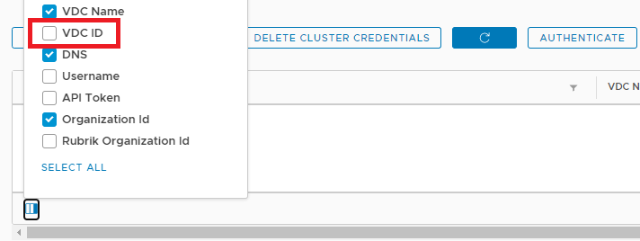
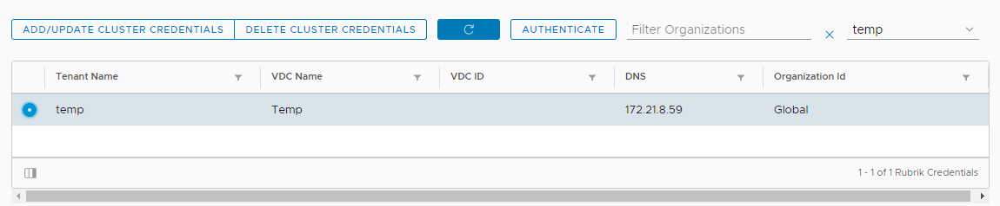
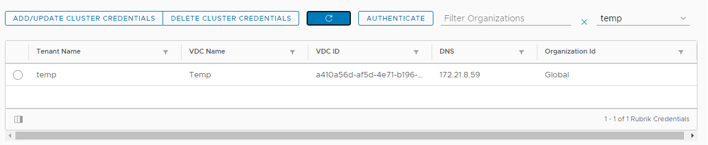

# Quick Start Guide: Rubrik Extension for VMware Cloud Director

Introducing the VMware Cloud Director Extension for Rubrik. This Repo will provide steps for Installing, Configuring and Using the Extension with Rubrik. This includes installation and configuration of the Lifecycle Management Plug-in for versions of VMware Cloud Director prior to 9.7.

Please find the GitBook for this plugin [here](https://rubrik.gitbook.io/vcd-extension-for-rubrik/)

## Patch Notes - v1.1.4 - 29 July 2020

### Breaking New Features

* Tenant Configuration is now VDC specific
* Provider portal displays a single Organization and VDC
* *REQUIRED:* Each Metadata Entries should be updated to set the VDC ID
    * For each Tenant configured under settings, enable the VDC ID column
    
        
        
    * Where the VDC ID is blank, select the row and delete or add/update the cluster credentials
    
        
    
    * If deleted, re-add the credentials, and check the VDC ID has been populated
    
        
    
### New Features

* Provider can now filter Organisations and VDCs in the protection screen
* Tenant now load specific VDCs and display vApps for that VDC only

### Bug Fixes
* Delete Metadata could remove the wrong VDC metadata
* File Restores with CDM 5.2 sometimes failed to restore
* Datagrid did not notify when unable to load vApps
* Datagrid loading now shows loading wheel and text whilst loading vApps
* Error Handling unable to report in some scenarios

### Compatibility

This release is VCD 9.1, 9.5, 9.7 and 10.0 supported only

## Patch Notes - v1.1.3 - 18 June 2020

### New Features

* Activity Monitor now available
* CORS Support (Nginx Proxy no longer required with Rubrik CDM 5.2)
* Provider Authentication View updated to select either Basic Auth or API Token

### Bug Fixes
* Snapshots do not load during instant restore/export clarity wizards (5.2 on VCD 10.0)
* 5.2 Events internal API endpoints deprecated and moved to v1
* 5.2 File Recovery failed due to field shouldUseAgent now being mandatory in the API request.
* 5.2 Events API - When no key latestEvent, no error handle and calls stop
* Activity Detail Icons no longer map to clarity icons
* shouldPowerOnVMs present in Export Payload, when only used in Instant Recovery
* If Export Values are left blank, undefined is appended to VM Suffix and vApp Name
* API Tokens did not clear the loading flag during Provider Authentication
* Activity Monitor did not authenticate on initial load as a provider

### Compatibility

This release is VCD 9.1, 9.5, 9.7 and 10.0 supported only

## Patch Notes - v1.1.2 - 24 March 2020

### New Features

* VM Exclusion now supported from the Plugin
* Manual Authentication overhaul
* Provider Settings now validates tenant credentials
* Doc updates for New Organisation Features with 5.1.2

### Bug Fixes

* Export Organisations Incorrectly Displayed
* Manual Authentication for Providers would not report back when failing
* Heirarchy of VCD Cells sending undefined API calls
* Reporting not filtering specific VCD vApps
* Events API changes for 5.1.2

### Compatibility

* Support for VCD 9.7 - Requires CDM 5.1+
* Support for VCD 10.0 - Requires CDM 5.1.2

## Patch Notes - v1.1.1 - 11 November 2019

### Bug Fixes

* Fixed SLA Compliance for changes in Rubrik v5.1
* Added Backwards compatibility between 5.0.x and 5.1.x when running multiple VCD Cells
* Fixed Metadata in header to support full feature enablement (Dashboards)
* Various payload fixes for Rubrik v5.1

## Compatibility

* Requires Rubrik v5.1.0 or v5.1.1 to support VCD 9.7
* Plugin is backwards compatible for Rubrik v5.0.x & v4.x.x

## Patch Notes - v1.1.0 - 23 June 2019

### Existing Features

* On Demand Snapshots
* Assign SLA Protection
* Recover vApp
* File Recovery
* Export vApp
* Credential Management

### New Features for 1.1.0
* Dashboard Feature
    * Protected vApps
    * SLA Summary
    * Summary Graphs
* Reporting 
    * SLA Compliance - Details
    * Capacity Over Time - Details
    * Protection/Recovery Tasks - Details
* Username Encryption Added for Metadata
* Branding/White-label added
* Ability to see Events per vApp
* Event Series - In depth task details
* Provider Authentication Moved inside Modal
* Rubrik Organisation Support - Global and Org both supported

### Bug Fixes
* Fixed a bug with metadata updating/deleting
* Fixed a bug with vApps containing `+` symbols
* Fixed Issues with Tenant access to 2x VCD Cells in Rubrik with a same named vApp
* Fixed Issues with SLAs not loading - Rubrik Version (4.2 and 5.0+) detection added including SLAv2 Support
* Re-written Data Population for Protection Data-grid - async callbacks
* Polaris Managed SLAs temporarily hidden - Breaking On-Demand and SLA Assignment
* File Recovery Form Crashes after running Export (Refresh to Fix)
* Export Showing Fields to name vApp when Restoring to existing
* Export Not resetting all fields on cancel

## Introduction to the Rubrik Extension for VMware Cloud Director

The following section outlines how to get started using the Rubrik Extension for VMware Cloud Director. This includes installation and configuration of the plug-in, as well as how to import the [Lifecycle Management Plug-in](https://github.com/vmware/vcd-ext-sdk/tree/master/ui/plugin-lifecycle), configure credentials and leverage role-based access control (RBAC).

Workflow for installing the extension:
1. Install and Configure Nginx Reverse Proxy
2. Create a Certificate for Nginx Reverse Proxy
3. Build the VMware VCD Lifecycle Management Plug-in
4. Install the VMware VCD Lifecycle Management Plug-in
5. Deploy the Rubrik Extension for VMware Cloud Directory
6. Configure the Rubrik Extension for VMware Cloud Directory

### Rubrik Prerequisites

* Rubrik CDM 4.2+: Supports VCD 8.10 - 9.1
  * VCD 9.5 works with the exception of the "Export vApp" function
* Rubrik CDM 5.0: Supports VCD 8.10 - 9.5
* Rubrik CDM must be configured with a valid SSL Certificate
  * SSL Certificates that are self signed need to be trusted by the client before the extension will work
* Rubrik CDM must have the VMware Cloud Director (VCD) Cell Registered. Refer to Rubrik User Guide Section: "Adding a VMware Cloud Director instance".
* Rubrik Credentials are required to perform tasks via the Extension. Refer to "Using the Extension" Section.

### Additional Prerequisites

* VCD must be version 9.1.0.2 or newer. This is required due to earlier versions not supporting RxJS and HTTPClient.
* A Linux server or Container is required to run [nginx](https://www.nginx.com/), or another preferred reverse proxy. This guide currently only includes steps for installing and configuring nginx.
* The VMware [Lifecycle Management Plug-in](https://github.com/vmware/vcd-ext-sdk/tree/master/ui/plugin-lifecycle) is used to install the Rubrik Extension for VMware Cloud Director. Steps to build and install this plug-in are detailed below.

## Upgrading from 1.0.x

If the extension is already in use, we can upgrade the extension simply by installing through the existing Plugin Lifecycle Manager. 
You can upload to the plugin and disable to the previous version (1.0.x can be deleted after you are happy the upgrade is working).

:exclamation: Prior to allowing the extension for use, we will need to update the metadata as we now encrpyt the the username field as well as the password.

To perform these steps, open the `Settings` tab in provider view and first hit `Authenticate` and login. Once logged in, press `close` and select `Delete Metadata`.

Complete the wizard for the tenants you are adding metadata for and also selecting a Rubrik Organization:

* Use `Global` if you are not using any Rubrik Organization
* Select the relevant Rubrik Organization from the drop-down which is configured with the vApps and VM required.

Features are also new which allow white-label and Dashboard features on a per-tenant basis, use the sliders to enable the feature.

Select `Next` and `Confirm` to save the new metadata.

Open a tenant to confirm the vApps load in the `Protection` tab and the White-label/Dashboard features work as intended.

### Reverse Proxy

Before we can use the plugin, we need a Reverse Proxy between VCD and Rubrik, installation guides for this can be found in the Gitbook or [here](reverse-proxy/reverse-proxy.md)

### User Guide

For instructions on using the plugin, please refer to the Gitbook or the User guide section [here](user-guide/user-guide.md)
