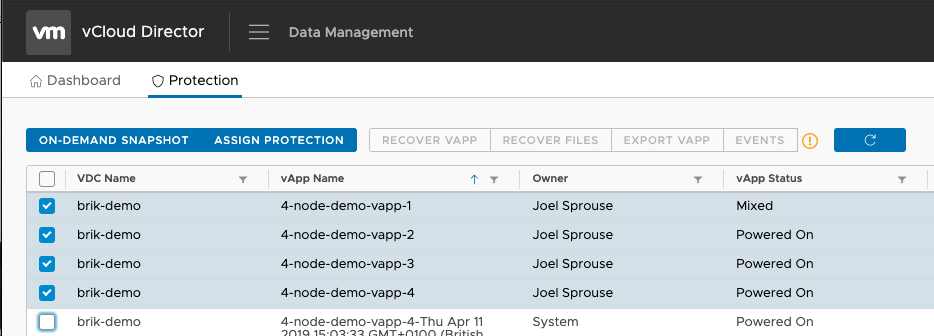
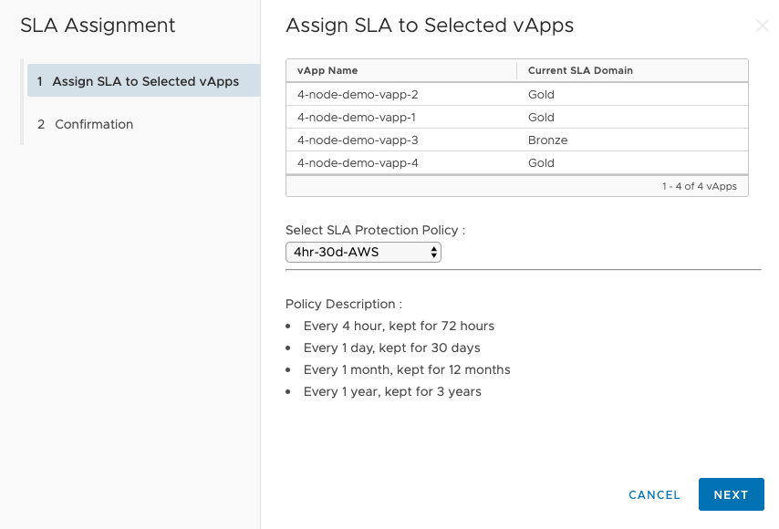
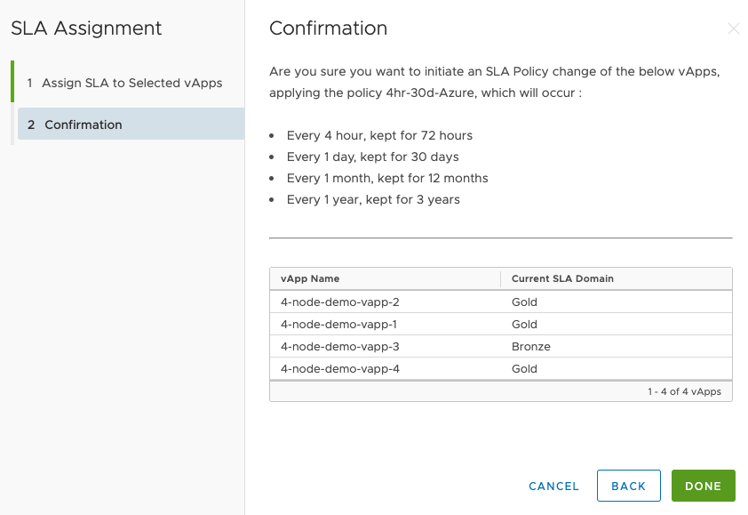
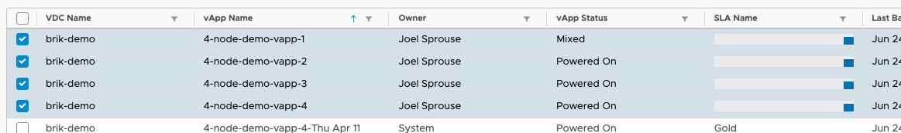
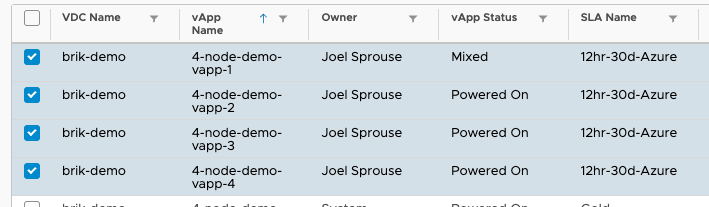

## Assign SLA to vApps

After the permissions have been configured, we can start performing self-service actions against the vApps. Assign Protection opens the wizard to allow us to assign and change SLAs associated to one or many vApps in the VMware Cloud Director Plugin.

First, we must select the vApps we want to perform this action against and select Assign Protection:

From here, we can select the SLA from the drop-down menu which will give us a quick overview of the Policy SLA values seen in the screenshot above.

Once confirmed, select `Next` and `Done` to confirm these changes. The Interface will update these values in the UI:

And will get a progress bar in the User Interface whilst the changes are being made:

And finally completion

Return to [User Guide](../user-guide.md)