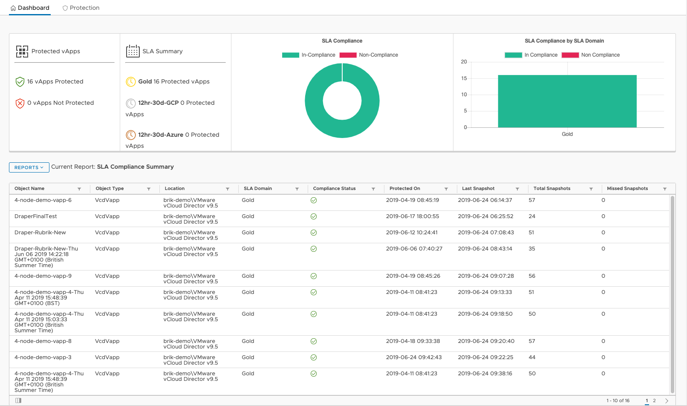
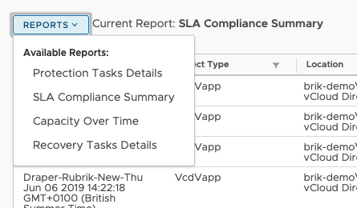
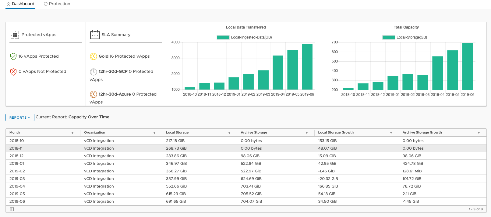

## Dashboard and Reporting

The dashboard will provide the following information:

* Number of vApps Protected (SLA Assigned)
* Number of vApps not Protected (No SLA Assigned)
* Top 3 SLAs by number of Objects and SLA Settings
* Graphs displaying values from the selected report
* Reports:
    * SLA Compliance Summary
    * Protection Task Details
    * Recovery Task Details
    * Capacity Over Time

Currently, the user will drop into the Protection page by default as the dashboard may be disabled for some tenants, however if it is toggled on by the tenant settings, this will appear on loading the plugin:

We can change the report by dropping down the `Reports v` button:

The tables will update with the new reports and the graphs will update with their new values.  These graphs will only show what objects the user has permission to see in Rubrik, so depending on what is configured under the Organisation, they will see reporting for only those objects. This includes the capacity consumption, so it will only display the capacity based on their permission:

Return to [User Guide](../user-guide.md)
