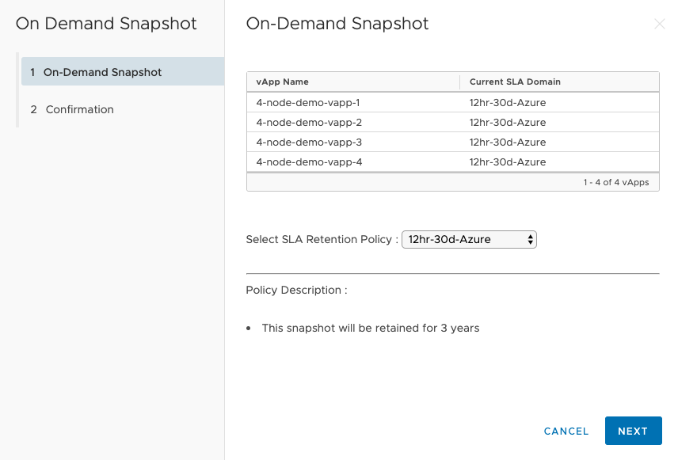
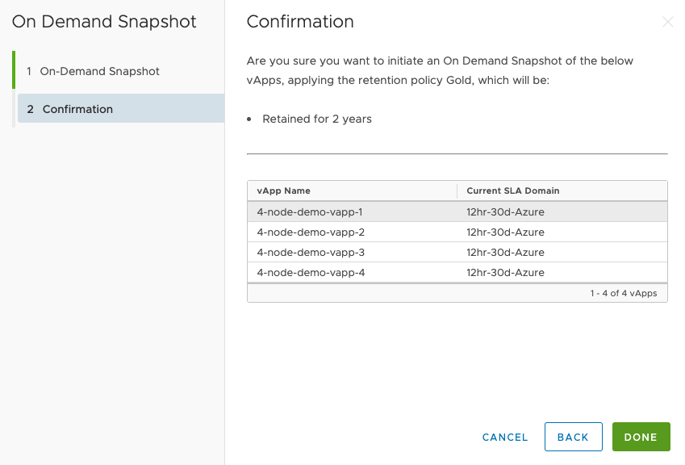
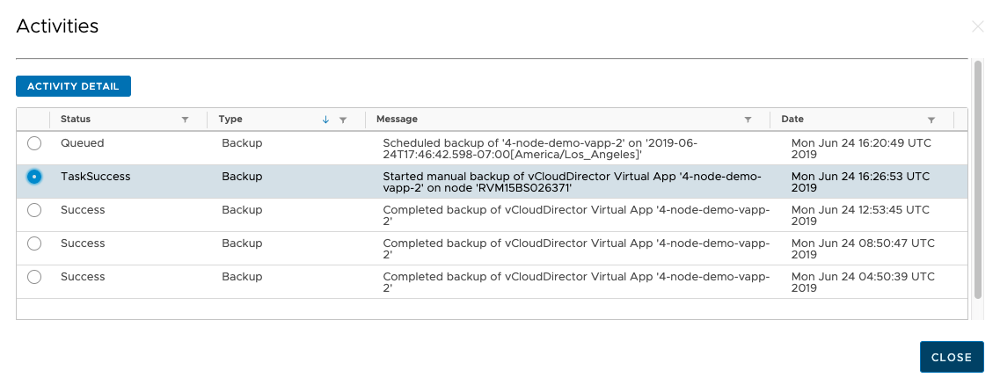
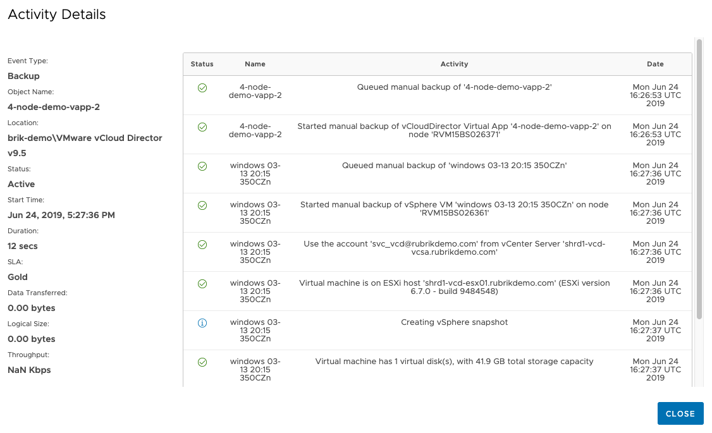

## On-Demand Snapshots

On-Demand Snapshots are extremely similar to Assigning SLAs but this will perform a one-off snapshot. We can select one or many vApps from the UI and perform this action against one or many.

First, select the vApps you would like to perform the snapshot for, and select `On-Demand Snapshot`

Once in the view for On-Demand Snapshot, select the relevant SLA which will confirm the retention for the snapshot in the Policy Description view (as seen above). Confirm the above by select Next and Done

Finally, we can see the job status from the Events button against the specific vApp:

Within the Events view, we can see specific detail regarding the event by selecting Activity Detail

Return to [User Guide](../user-guide.md)