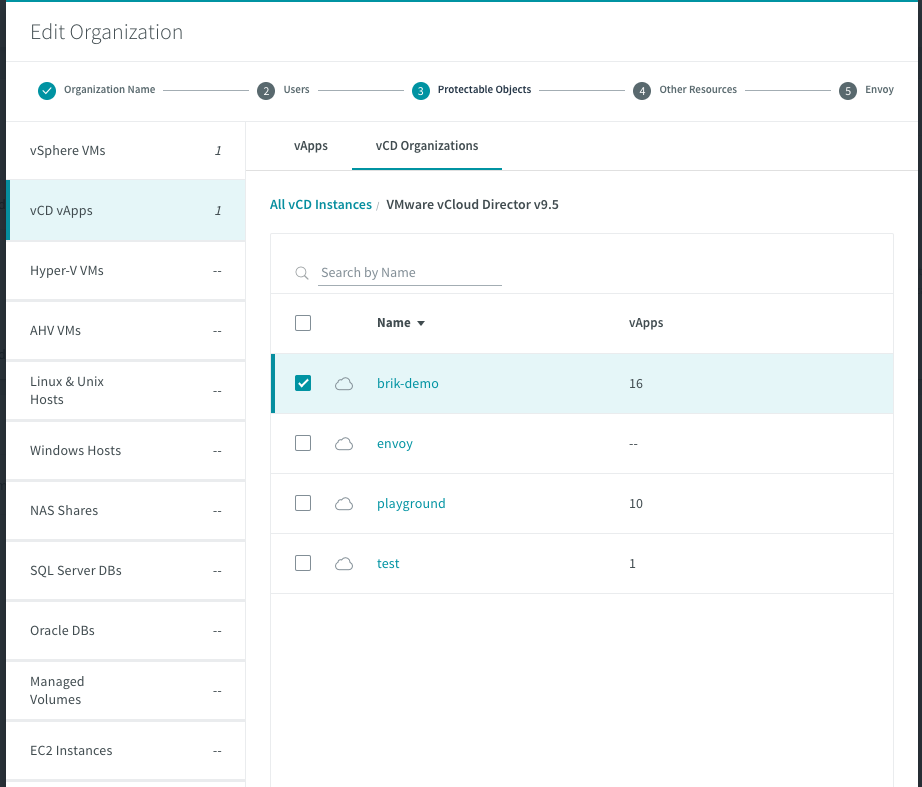
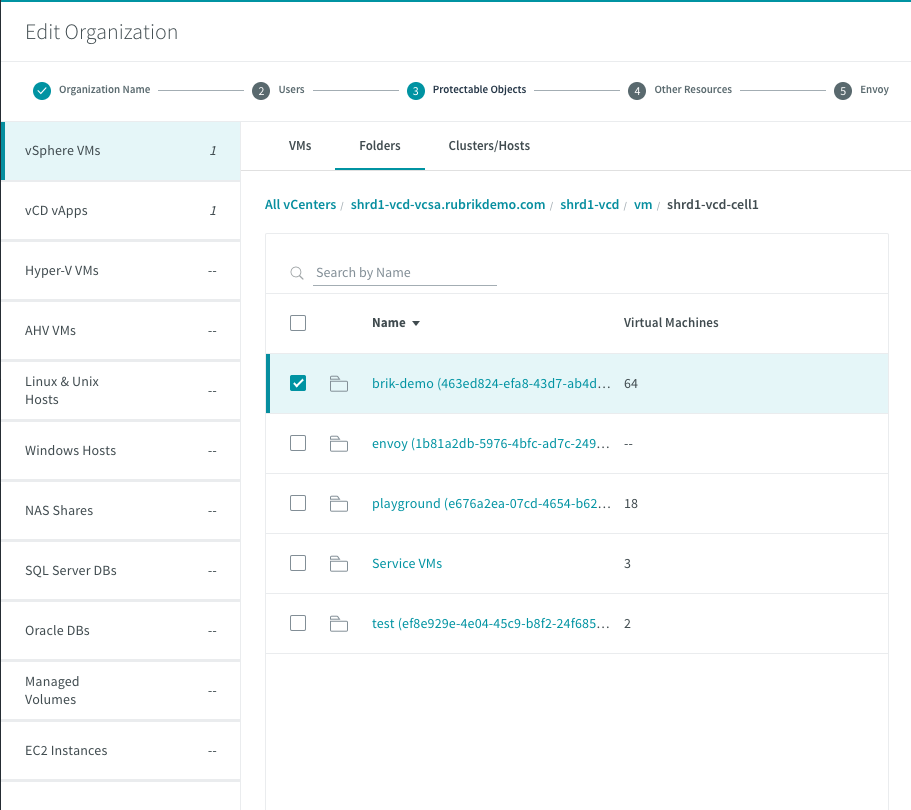
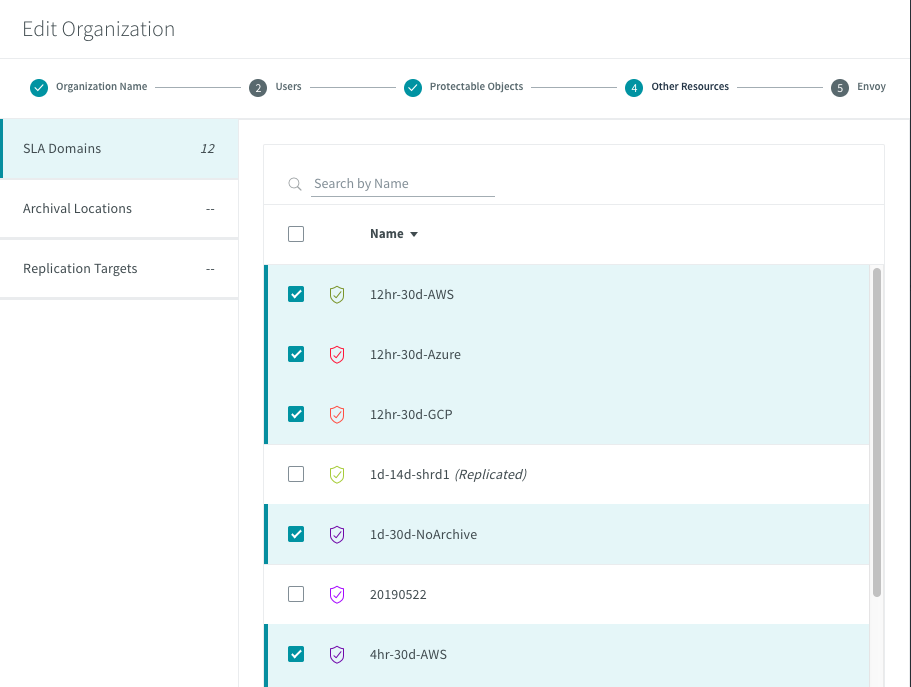
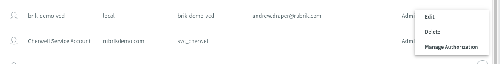
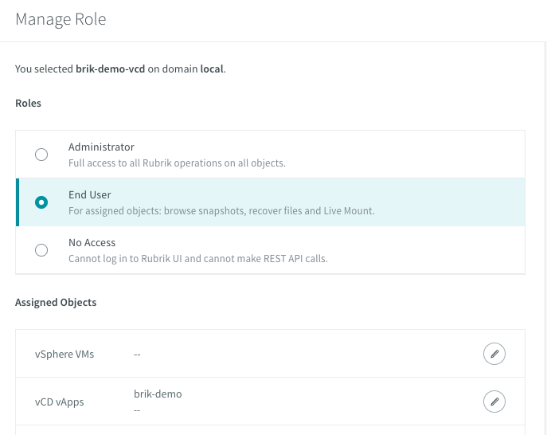

## Rubrik Permissions

Under the configuration of tenants, there is the capability to use both Global or a Rubrik Organisation; this allows the restriction under RBAC to restrict and permit actions in Rubrik using Rubrik Organisations. These steps are outlined entirely in the User Guide - `Chapter 4 - Multitenant Organizations`. 

For the vCloud Director Plugin, the recommendation would be to consider the following when setting up the Organisation.

*Permit based on vCloud Director Organisation or VDC*

When configuring the Organisation, we can permit access to any level in hierarchy within vCloud Director:

* vCloud Director Cell
* vCloud Director Organisation
* vCloud Director Organisation VDC

This allows permitting to all objects at each of these hierarchal points

Since vApps are logical containers we should also consider permitting the folder created within the vCentre so that VM level actions can be performed, such as File/Folder Restore. This appears in a similar hierarchy to the vCD Components:

* vCenter
* Host
* Folder
* Individual VMs

Since vCloud Director creates us a folder for all VMs, we can permission the specific folder for this organisation:

Finally, we can then permission which SLAs are available the vCloud Director plugin, this is on the next page inside the Organisation configuration:

The alternative to this, is to use Global which requires the user account in Rubrik to be setup using Manage Authorization with the End-User role. You can see this in the Users section in Rubrik:

And using Managed Authorization we can provide specific permissions:

Return to [User Guide](https://github.com/rubrikinc/rubrik-extension-for-vcd/blob/master/docs/user-guide/user-guide.md)