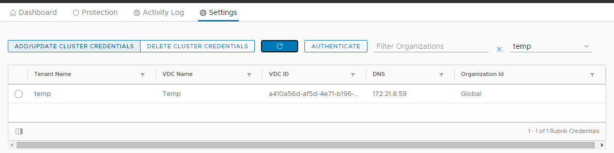
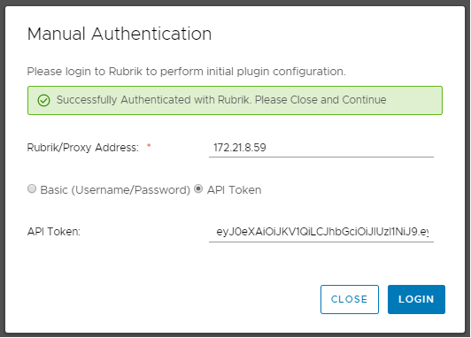
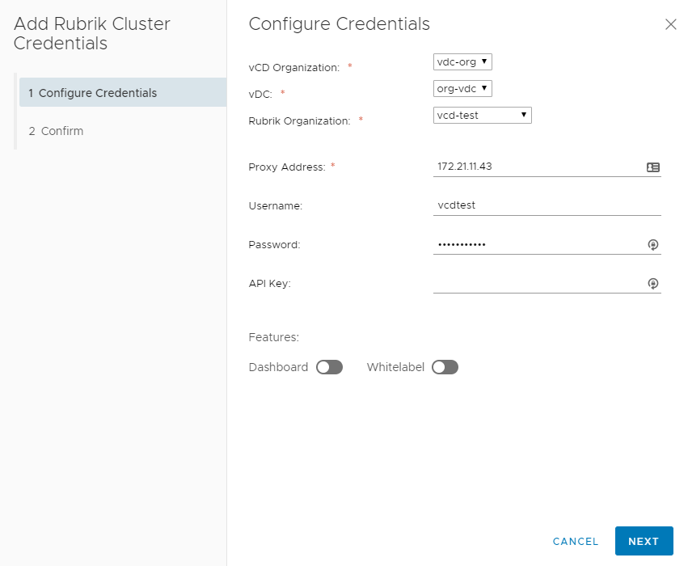
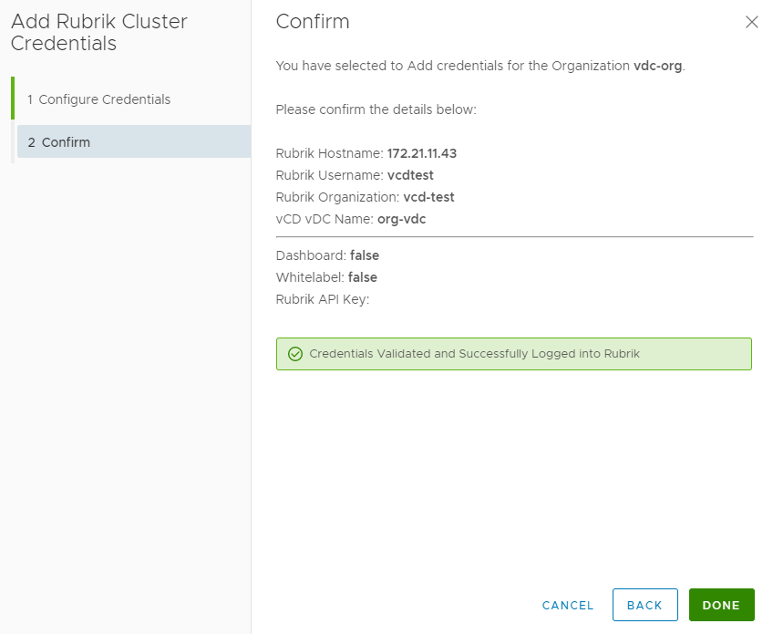

# Tenant Management

## Adding the Plugin to a Tenant

When sharing the plugin to a tenant via the VMware Customize Portal plugin, the plugin will require credentials configured for Rubrik so that the tenant can communicate with Rubrik to perform these self-service capabilities.

Open the Rubrik VMware Cloud Director Plugin and Navigate to `Settings`

First, Authentication is required to configure the Tenants, therefore if not so already, press Authenticate and login to the Rubrik Cluster using either Basic Authentication (Username/Password) or an long-lived API Token.

Once authenticated with Rubrik, select Add/Update Cluster Credentials - This will open up a wizard:

You can now select the VMware Cloud Director Organisation to add credentials for a specific VMware Cloud Director Tenant. 
Once select, you can now choose the Rubrik Organisation; we have 2 options at this point:
* `Global` - This will not specify the Rubrik Organisation and login as if the user is not in a Rubrik Organisation. To control permissions you will need to use the 
* `Rubrik Organsation` - There will a list of Rubrik Organisations that you can specify for the VMware Cloud Director Tenant

After confirming these 2 dropdown fields, we need to the Nginx Proxy and either specify a Username and Password or an API Token. Finally, we can toggle on/off the Dashboard and Remove the Rubrik Branding, with the `Whitelabel` toggle.

Press next to save these values in the VMware Cloud Director Tenant under the `Organization VDC`.

Once the Tenant now logins via the VMware Cloud Director Tenant URL, they will be able to load the plugin and use it with their existing VMware Cloud Director RBAC permissions and permissions that have been assigned by Rubrik.

### VMware Cloud Director RBAC Permissions

The Rubrik VMware Cloud Director Plugin uses the existing user's permissions in VMware Cloud director and therefore only displays vApps that the user has permission to inside of VMware Cloud Director. This ensures they are not able to perform other actions on vApps they do not have permission to from VMware Cloud Director within the plugin.

Return to [User Guide](../user-guide.md)
