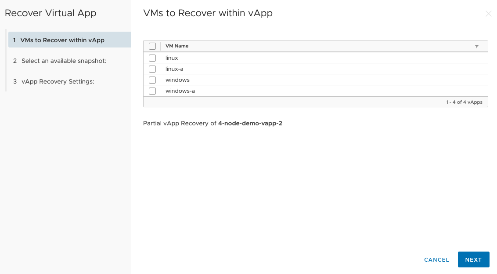
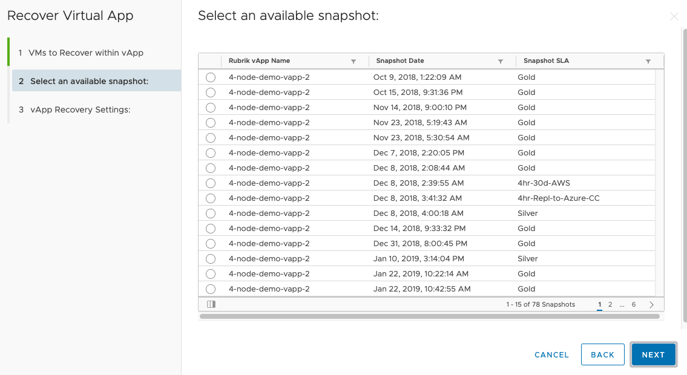
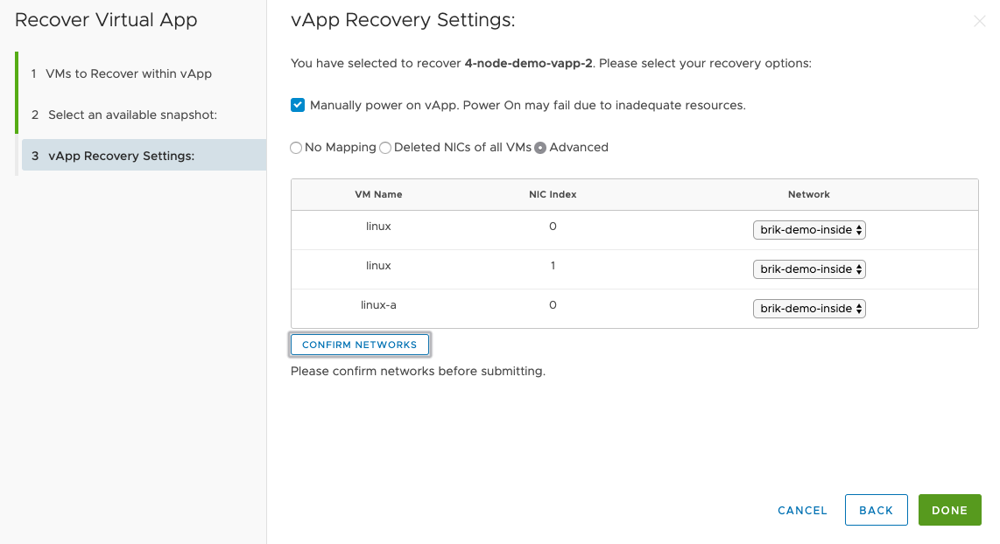
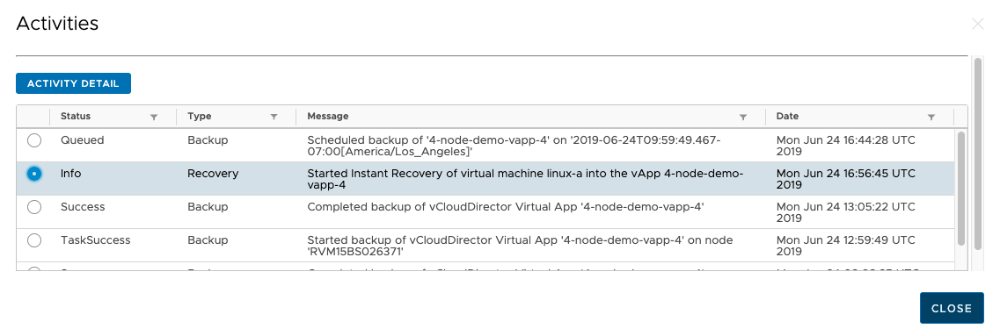
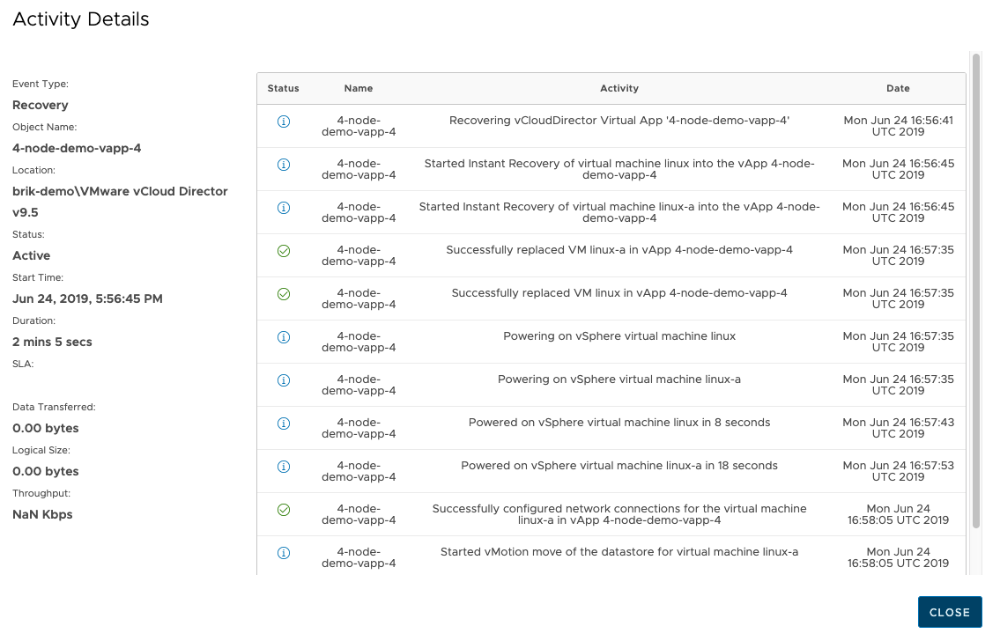

## vApp Instant Recovery

### In-place Restores for vApp

Restoring vApps can be performed to recovery partial or full VMs within the vApp. This can only be performed for individual vApps. First, select the vApp for Recovery and select `Recover vApp`

We can then select which VMs we want to perform recovery against; select the VMs, and then select `Next` to see a list of valid snapshots:

Select the specific snapshot, and select `Next`

Finally, as part of the last step, we need to confirm the network and startup settings for the VMs, the following options are available:

* `No Mapping` - This leaves the Network Adapters in place, but does not connect them
* `Delete NICs of all VMs` - This will remove all NICs from the selected VMs when they are restored so they cannot conflict with existing values
* `Advanced` - This will allow to choose available Networks on a per NIC basis and re-assign the networks during the restore. This needs to be Confirmed before proceeding.

Once we press Done the restore will proceed. We can see the activity on this by checking the Events button for the specific vApp.

And from Activity Detail we can see the specific tasks:

Return to [User Guide](https://github.com/rubrikinc/rubrik-extension-for-vcd/blob/master/docs/user-guide/user-guide.md)

